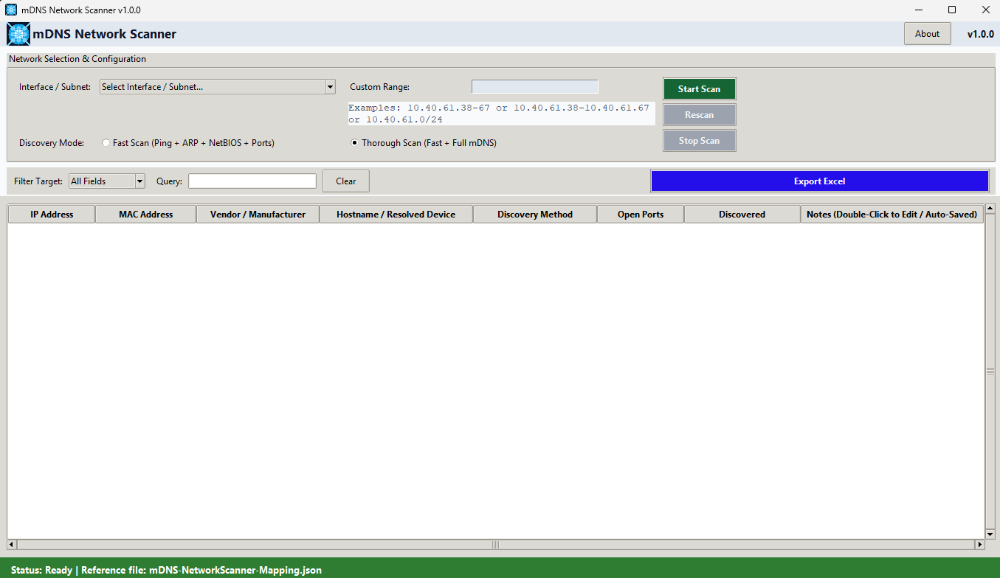

# NetScanNotebook



Originally released as mDNS Network Scanner. Rebranded to NetScanNotebook to better reflect its focus on local discovery, device inventory, and persistent notes.

Fast, Windows-native network discovery for people who want a clean view of what is actually on their local network.

NetScanNotebook identifies active devices, resolves host metadata, audits common ports, and keeps per-device notes tied to the real MAC address so they remain useful across IP changes. It is built for subnet scans, custom ranges, and fast rescan workflows.

This is the part that sets it apart: unlike many network scanners that only list devices, NetScanNotebook lets you attach notes to each device and keep that context even as IP addresses change.

## Features

- Active interface and subnet discovery
- Custom IP / range / CIDR scanning
- ICMP ping sweeps and Windows ARP probing
- Hostname and NetBIOS resolution
- MAC-based vendor lookup
- Common port auditing
- Green-highlighted new discoveries on rescan
- Persistent per-device notes keyed by MAC address
- Sortable, filterable results grid
- Excel / CSV export

## Supported targets

```text
192.168.1.0/24
10.40.61.38-67
10.40.61.38-10.40.61.67
10.40.61.66
```

## Why it exists

This tool is designed for quick local network visibility and organized device tracking across repeated scans. Whether you are validating a subnet, auditing a lab environment, or documenting devices across a changing IP layout, the scanner keeps the results readable and actionable.

## Notes

- Built for Windows environments
- Device notes are saved locally and associated by MAC address, not just IP, which helps preserve context as addresses change
- The Clear action resets the active query and sort state
- Newly discovered devices are highlighted in green during rescans

## Requirements

- Python 3.10+
- Windows

The app will automatically install missing required Python packages the first time it starts if they are not already available. Manual installation is optional but can be useful for a standard local setup.

```powershell
pip install -r requirements.txt
```

## Run it

```powershell
python .\mDNS-NetworkScanner-GUI.py
```

## Version

Current version: 1.0.0

## License

This project is distributed under a custom SOSTRAX Shared Source License. Commercial use requires a separate written license agreement.

## Attribution

Designed by Michael Dietz  
SOSTRAX  
mike@sostrax.com

